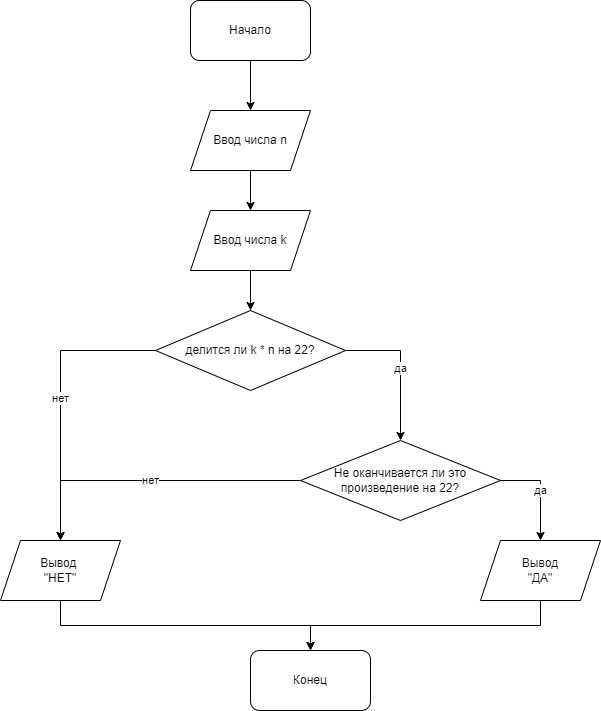

# Задача 28

Напишите программу, которая по двум входным целым натуральным числам определяет, является ли произведение этих чисел кратным 22, но не оканчивающимся на 22. Если да, то вывести «Да», иначе – вывести «Нет».

