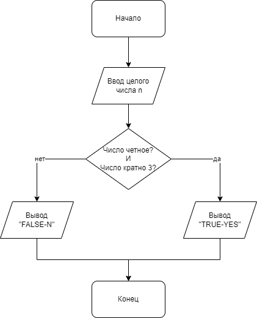

# Задача 7

Напишите программу, которая при вводе целого числа определяет, является ли число четным и кратным 3. Программа должна вывести «TRUE-YES», если число четное и кратное 3, и «FALSE-N» в обратном случае.

Алгоритм решения:

